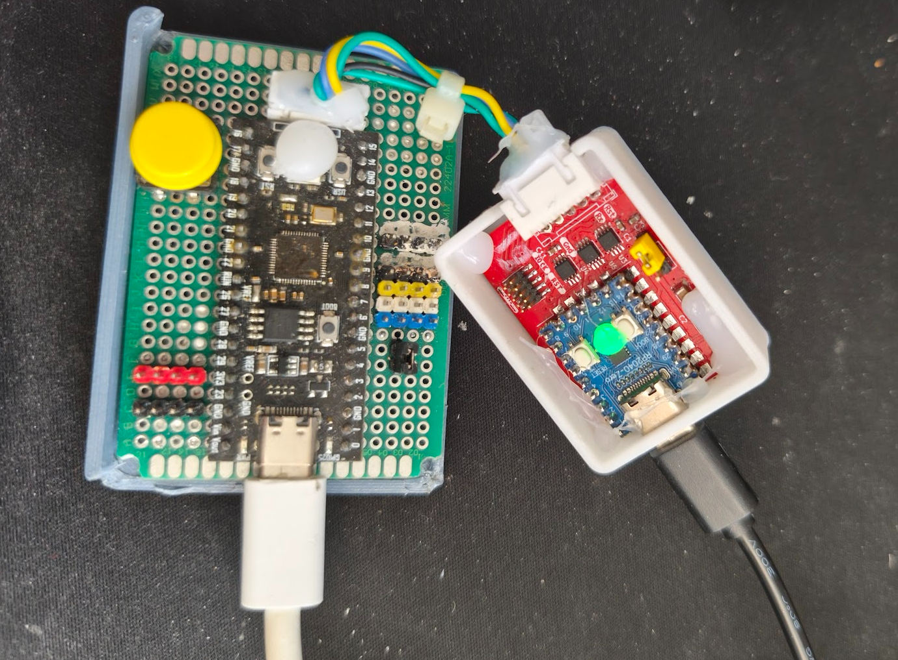
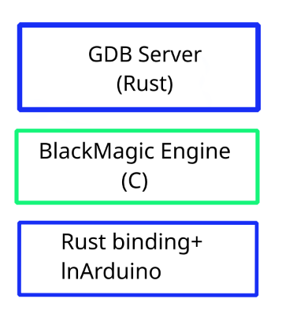
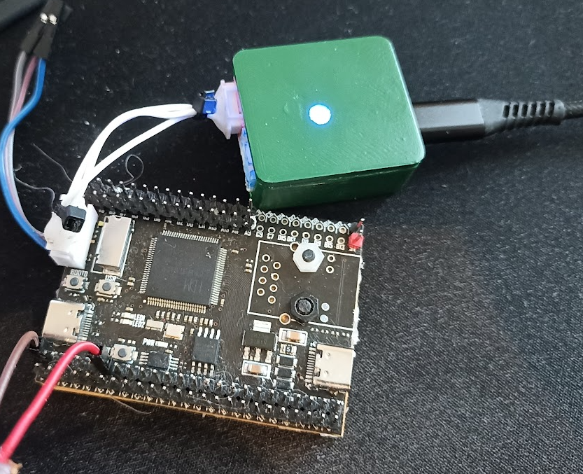

<picture>
  <source media="(prefers-color-scheme: dark)" srcset="assets/web/swindle_demo2.png">
  
</picture>

<h1 align="center">🔧 SWINDLE — ARM / RISC-V Debug Probe</h1>

<p align="center">
  <b>Turn any cheap dev board into a full-featured debug probe.</b>
</p>

<p align="center">
  <a href="https://github.com/mean00/swindle/wiki">
    
  </a>
  
  
  
  
</p>

<blockquote>
  <strong>TL;DR</strong> — Got an RP2040 board lying around? You've got a debug probe.<br>
  Swindle is a <strong>multi-platform debug probe</strong> for embedded devices, supporting <strong>SWD</strong> (ARM Cortex-M) and <strong>RVSWD</strong> (RISC-V CH32V2xx/CH32V3xx). It's powered by the incredible <a href="https://black-magic.org/index.html">Black Magic Probe</a> engine with a custom Rust-based GDB interface.
</blockquote>

---

<p align="center">
  
  <br>
  <em>A tiny RP2040-Zero debugging a full-sized RP2040</em>
</p>

---

## ✨ Features

| Category | Details |
|----------|---------|
| **🧠 Engine** | Built on top of the proven [Black Magic Probe](https://black-magic.org/index.html) firmware engine |
| **🦀 GDB Interface** | Written in **Rust** — modern, safe, and maintainable |
| **🔌 Protocols** | SWD (ARM) + RVSWD (RISC-V) — no JTAG |
| **🎯 Breakpoints** | Infinite breakpoints in RAM (ARM/RV32) + soft flash breakpoints for targets without HW breakpoints (some WCH chips) |
| **📡 RTOS Support** | **FreeRTOS** awareness and **SEGGER RTT** out of the box — no configuration needed |
| **💾 DFU Update** | Firmware updates over USB DFU — no programmer required |
| **📺 RTT Channel** | Dedicated USB Tx only RTT channel (RP2xxx & CH32V3xx) |
| **🌐 Networking** | Experimental networked version based on **CH32V307** or RP2040+W5500 (DHCP + port 2000/20001) |
| **🔋 Low Cost** | RP2040-Zero boards are dirt cheap! |
| **🔧 Voltage Translation** | Optional custom PCB with voltage level translators |

---

## 🧩 Supported Hardware

### Probe Hosts (runs Swindle)

You need **≥256 KB flash** and **≥48 KB RAM**.

| Platform | Status | Notes |
|----------|--------|-------|
| **RP2040** (e.g. RP2040-Zero) | ✅ Stable | The most affordable option |
| **RP2350** (e.g. RP2350-Zero) | 🧪 Experimental | |
| **GD32F303CCT6** (48/64-pin) | ✅ Stable | |
| **CH32V30xxx** | ✅ Stable | RISC-V based host |
| **Custom PCB** | 🧩 Optional | With voltage translators, mosfet on reset, ws2812 |

### Debug Targets

| Architecture | Protocol | Device Families |
|-------------|----------|-----------------|
| **ARM Cortex-M** | SWD | RP2040, RP2350, STM32, GD32, and many ARM Cortex-M with SWD |
| **RISC-V** | RVSWD | WCH CH32V2xx, CH32V3xx |

---

## 🚀 Getting Started

### 1. Flash the firmware

Pick the pre-built firmware for your board or [build from source](#-building).

> **Flashing via DFU (RP2040):** Hold `BOOTSEL`, plug in USB, then copy the `.uf2` file.

### 2. Connect to your target

```
Probe SWDIO  →  Target SWDIO
Probe SWCLK  →  Target SWCLK
Probe GND    →  Target GND
Probe NRST   →  Target NRST   (optional, recommended)
Probe TX     →  Target Uart TX    (optional)
```

'see wiki for exact pinout'
### 3. Start debugging

```bash
# Connect with GDB
gdb-multiarch -ex "target extended-remote /dev/ttyACM0" -ex "mon swdp_scan" -ex "attach 1" your_firmware.elf
```

Or use any GDB frontend (VS Code, CLion, etc.) — just point it to the serial port.

---

## 🔨 Building

This project uses **CMake** with presets for each target platform.

There is a devpod/docker build environment included.


### Prerequisites

- CMake ≥ 3.21
- ARM GCC toolchain (`arm-none-eabi-gcc`) or LLVM/Clang
- RISC-V toolchain (for CH32V targets)
- Rust toolchain (for the GDB interface)

### Configure & Build

```bash
# Configure for your target
cmake --preset rp2040          # RP2040-Zero
cmake --preset rp2350          # RP2350-Zero
cmake --preset gd32f303_48     # GD32F303 48-pin
cmake --preset gd32f303_64     # GD32F303 64-pin
cmake --preset ch32v307        # CH32V307 (networked)

# Build
cmake --build --preset rp2040
```

> **Note:** Some presets have variants with inverted NRST (`*_inv`), with WS2812 RGB led.
> See `CMakePresets.json` for the full list.

| Preset | Description |
|--------|-------------|
| `rp2040` | RP2040-Zero (USB) |
| `rp2040_inv` | RP2040-Zero with inverted NRST |
| `rp2350` | RP2350-Zero (USB, experimental) |
| `gd32f303_48` | GD32F303 48-pin (USB) |
| `gd32f303_64` | GD32F303 64-pin (USB) |
| `gd32f303_48_inv_ws2812` | GD32F303 48-pin (USB) +WS2812 +inv RST |
| `gd32f303_64_inv_ws2812` | GD32F303 64-pin (USB) +WS2812 +inv RST |
| `ch32v307` | CH32V30x (USB) |
| `ch32v307_inv_ws2812` | CH32V30x (USB) +ws2812 + inv RST|
| `ch32v307_net` | CH32V307 (Ethernet, experimental) |
| `rp2040_zero_w5500` | rp2040+w5500 (Ethernet, experimental) |

---

## 📘 Documentation

Full documentation is available on the **[Swindle Wiki](https://github.com/mean00/swindle/wiki)** — covering:

- 🔧 Hardware setup and wiring guides
- 🖥️ GDB integration and troubleshooting
- ⚙️ Advanced configuration
- 🧪 RTOS-aware debugging
- 🌐 Networked probe setup

---

## 🏗️ Project Architecture

```
swindle/                    # Debug probe wrapper
├── rs/                     # Rust GDB interface (rs_swindle / rsbmp)
│   ├── rs_swindle/         # Core GDB logic
│   └── rs_swindle_wrapper/ # C → Rust bridge
└── swindle/                # C++ Black Magic Probe engine + wrapper

esprit/                     # C++ / Rust SDK framework (HAL + RTOS + MCU drivers)

assets/                     # Images and media
cmake/                      # Project-level CMake utilities
```

---

## 🖼️ Gallery

| Small probe, big target | RP2040 + CH32V |
|:------------------------:|:--------------:|
|  |  |

---

## 🤝 Contributing

Contributions, issues, and feature requests are welcome!
Feel free to check the [issues page](https://github.com/mean00/swindle/issues).

---

## 📄 License

This project is built on the [Black Magic Probe](https://black-magic.org/index.html) engine, licensed under **GPL-3.0**.
